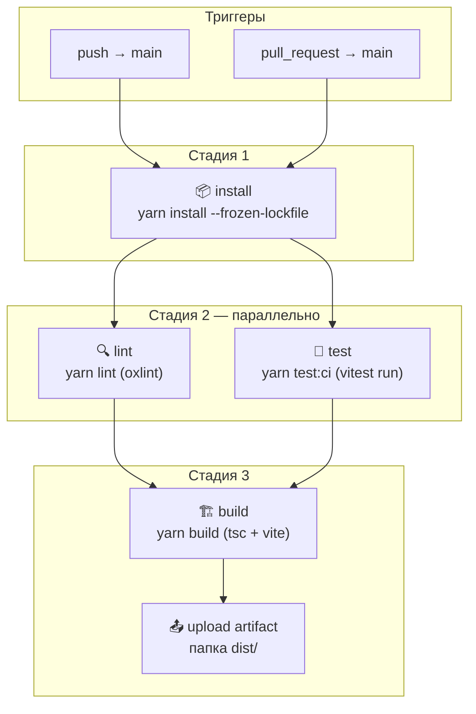

# github-actions-practise

Учебный проект: настройка GitHub Actions для автоматической проверки и сборки React + Vite приложения.

## CI Pipeline

При push или pull request в ветку `main` запускается workflow [`.github/workflows/ci.yml`](.github/workflows/ci.yml).

### Схема пайплайна



### ASCII-схема (как в GitHub Actions UI)

```
                    ┌─────────────┐
   push / PR ──────►│   install   │
                    └──────┬──────┘
                           │
              ┌────────────┴────────────┐
              ▼                         ▼
       ┌────────────┐            ┌────────────┐
       │    lint    │            │    test    │
       └──────┬─────┘            └──────┬─────┘
              │                         │
              └────────────┬────────────┘
                           ▼
                    ┌─────────────┐
                    │    build    │
                    └──────┬──────┘
                           ▼
                    ┌─────────────┐
                    │  artifact   │
                    │   (dist/)   │
                    └─────────────┘
```

### Стадии

| Стадия | Job | Команда | Что проверяет |
|--------|-----|---------|---------------|
| 1. Установка | `install` | `yarn install --frozen-lockfile` | Зависимости из `yarn.lock` устанавливаются без ошибок |
| 2a. Линтинг | `lint` | `yarn lint` | Качество кода (oxlint) |
| 2b. Тесты | `test` | `yarn test:ci` | Unit-тесты (vitest, однократный прогон) |
| 3. Сборка | `build` | `yarn build` | TypeScript + production-сборка Vite |

### Важные детали

- **Параллельность**: `lint` и `test` запускаются одновременно после `install` — это ускоряет пайплайн.
- **Зависимости между jobs**: `build` ждёт успешного завершения и `lint`, и `test`.
- **Отдельные runners**: каждый job — новая виртуальная машина; `node_modules` не передаются между jobs, но Yarn-кеш ускоряет повторную установку.
- **Артефакты**: после сборки папка `dist/` сохраняется на 7 дней — её можно скачать во вкладке Actions.

## Локальный запуск тех же команд

```bash
yarn install          # установка
yarn lint             # линтинг
yarn test:ci          # тесты (как в CI)
yarn build            # сборка
```

## Дополнительно

- [`.github/workflows/github-actions-demo.yml`](.github/workflows/github-actions-demo.yml) — вводный demo-workflow для изучения синтаксиса Actions (не заменяет CI).
